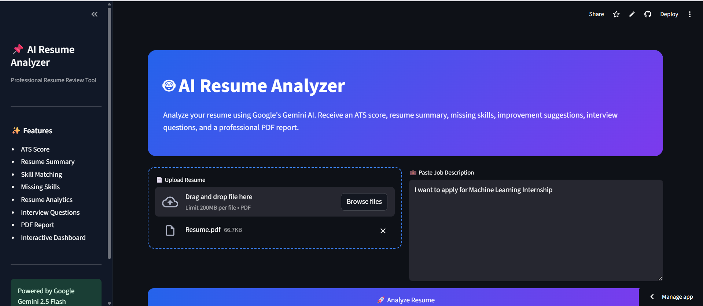
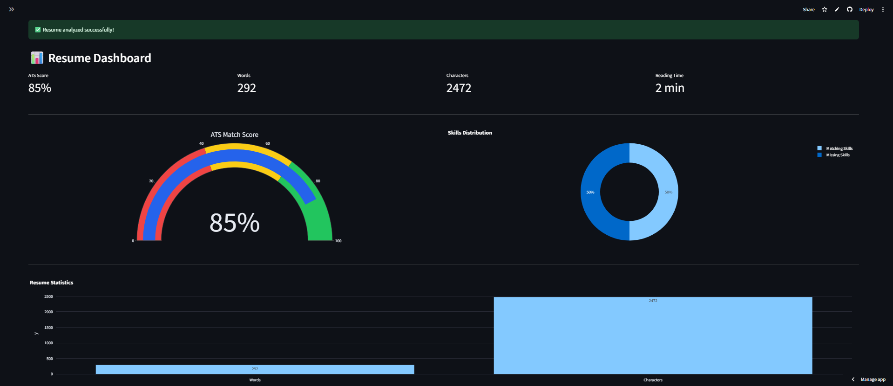
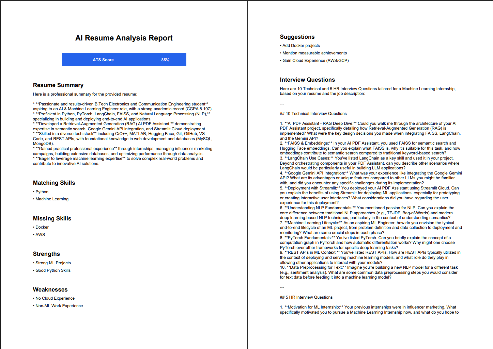

# 🤖 AI Resume Analyzer

An AI-powered Resume Analyzer built with **Python, Streamlit, and Google Gemini** that evaluates resumes against a job description, calculates an ATS compatibility score, identifies missing skills, generates personalized improvement suggestions, creates interview questions, and exports a professional PDF report.

---

## 🚀 Live Demo

🔗 **Streamlit App:** https://artificial-intelligence-resume-analyzer.streamlit.app/

🔗 **GitHub Repository:** https://github.com/shreyvirmani/AI-Resume-Analyzer

---

## ✨ Features

- 📄 Upload resumes in PDF format
- 💼 Analyze resumes against any job description
- 🎯 AI-generated ATS Match Score
- ✅ Identify matching skills
- ❌ Detect missing skills
- 💡 Personalized resume improvement suggestions
- 📝 Professional AI-generated resume summary
- 🎤 AI-generated interview questions
- 📊 Interactive analytics dashboard with charts
- 📥 Download a detailed PDF analysis report
- ⚡ Modern and responsive Streamlit UI

---

## 🛠️ Tech Stack

| Category | Technologies |
|----------|--------------|
| Language | Python |
| AI Model | Google Gemini 2.5 Flash |
| Framework | Streamlit |
| Data Visualization | Plotly |
| PDF Processing | PyMuPDF |
| PDF Report | ReportLab |
| Environment | Python-dotenv |

---

## 📂 Project Structure

```text
AI-Resume-Analyzer/
│
├── app.py
├── streamlit_app.py
├── requirements.txt
├── README.md
├── .gitignore
│
├── assets/
│   └── styles.css
│
├── src/
│   ├── analyzer.py
│   ├── charts.py
│   ├── extractor.py
│   ├── prompts.py
│   ├── report_generator.py
│   ├── ui.py
│   └── utils.py
│
└── images/
```

---

## ⚙️ Installation

### 1. Clone the repository

```bash
git clone https://github.com/shreyvirmani/AI-Resume-Analyzer.git
cd AI-Resume-Analyzer
```

### 2. Create a virtual environment

```bash
python -m venv venv
```

Activate it:

**Windows**

```bash
venv\Scripts\activate
```

**macOS/Linux**

```bash
source venv/bin/activate
```

### 3. Install dependencies

```bash
pip install -r requirements.txt
```

### 4. Configure API Key

Create a `.env` file in the project root.

```env
GOOGLE_API_KEY=YOUR_GEMINI_API_KEY
```

### 5. Run the application

```bash
streamlit run app.py
```

---

## 📖 How It Works

1. Upload your resume (PDF).
2. Paste the target job description.
3. Click **Analyze Resume**.
4. The AI:
   - Extracts resume text
   - Generates a professional summary
   - Calculates ATS compatibility
   - Finds matching and missing skills
   - Suggests improvements
   - Generates interview questions
5. Download the complete analysis as a PDF report.

---

## 📸 Screenshots

### 🏠 Home Page

> 

---

### 📊 ATS Dashboard

> 

---

### 📄 PDF Report

> 

---

## 🎯 Learning Outcomes

This project strengthened my understanding of:

- Large Language Models (LLMs)
- Prompt Engineering
- Google Gemini API Integration
- ATS Resume Analysis
- PDF Text Extraction
- Interactive Dashboard Development
- AI-powered Recommendation Systems
- Streamlit Application Development
- PDF Report Generation
- Modular Python Project Architecture

---

## 🔮 Future Improvements

- AI Cover Letter Generator
- Resume Keyword Optimizer
- Multiple Resume Comparison
- Resume History Dashboard
- Multi-language Support
- Authentication & User Accounts
- Cloud Database Integration

---

## 👨‍💻 Author

**Shrey Virmani**

B.Tech – Electronics & Communication Engineering

Passionate about Artificial Intelligence, Machine Learning, and Full-Stack AI Applications.

- 💼 LinkedIn: *Add your LinkedIn profile*
- 🐙 GitHub: *Add your GitHub profile*

---

## ⭐ Support

If you found this project useful, consider giving it a **⭐ Star** on GitHub.

It motivates me to build more AI-powered applications and contribute to the developer community.

---

## 📜 License

This project is licensed under the **MIT License**.